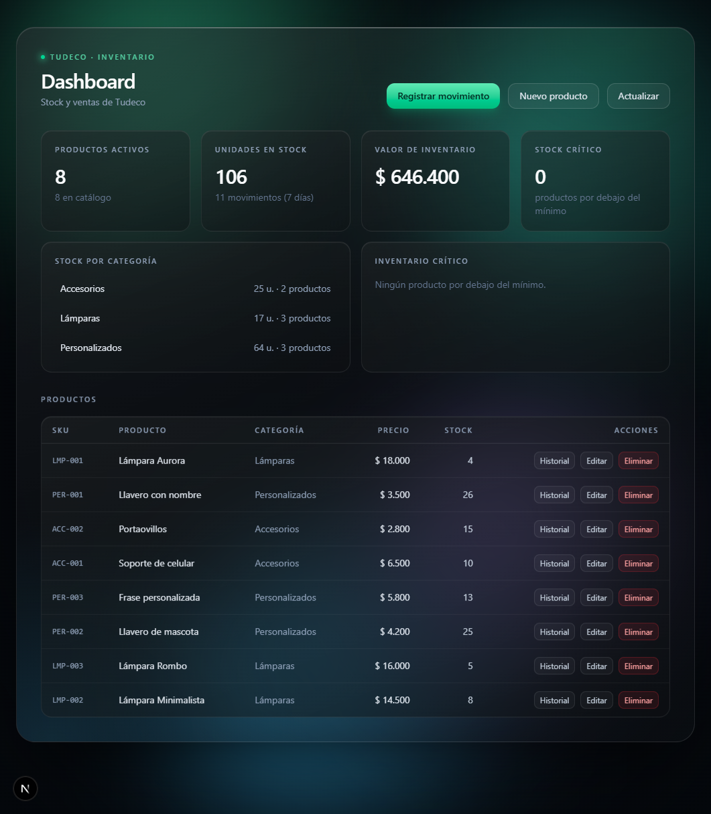
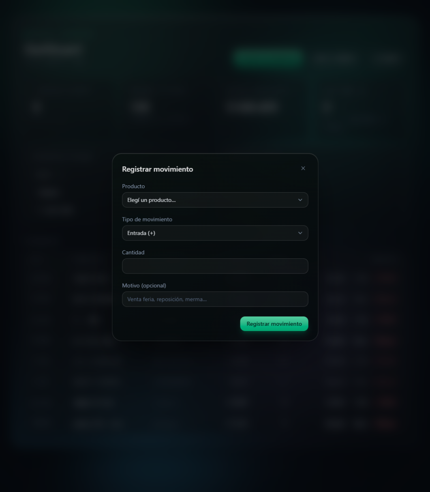
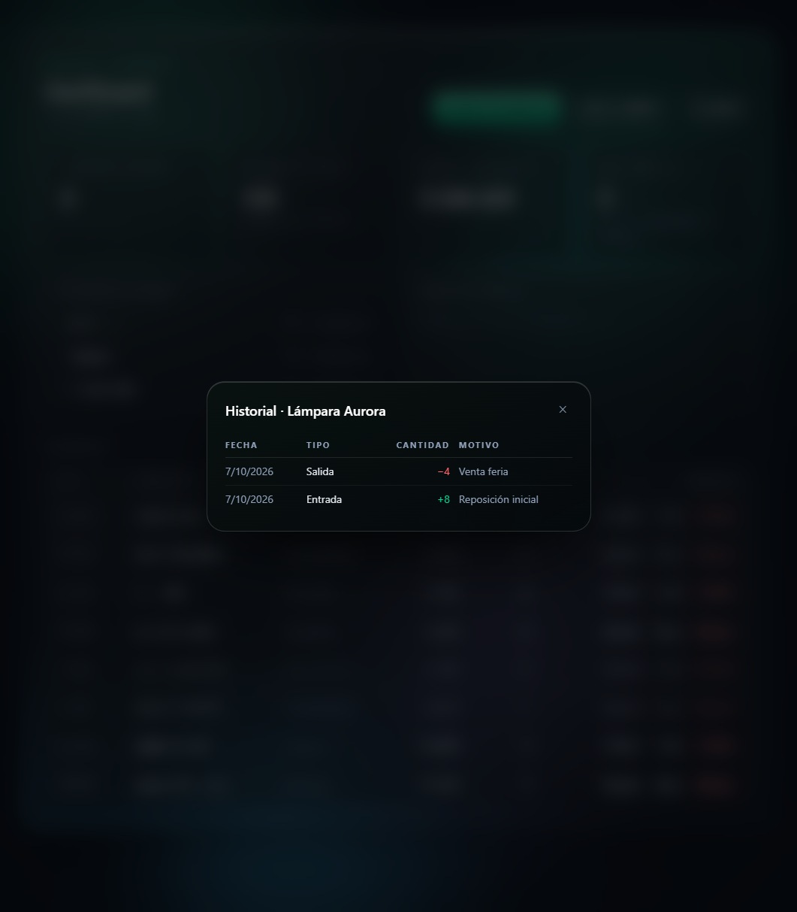
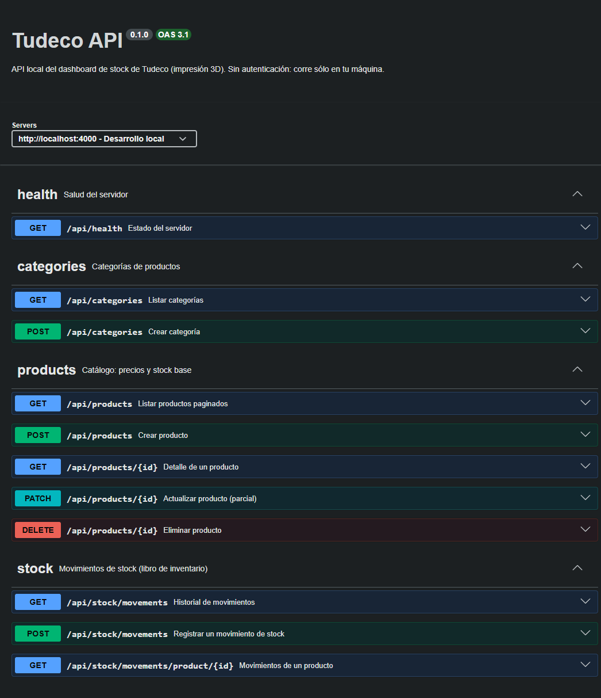

# tudeco-dashboard


> Stock, precios y productos de un emprendimiento de impresión 3D: **una API REST**
> y **un dashboard web** conviviendo en el mismo monorepo. Sin auth, sin humo:
> `npm run dev` y a trabajar.



## 🏁 Arrancar

**Necesitás:** Node 20+ y PostgreSQL corriendo.

```bash
npm install
cp back/.env.example back/.env   # contraseña de PostgreSQL
npm run db:migrate               # esquema + datos de ejemplo (seed)
npm run dev                      # api en :4000 + web en :3000
```

Listo → **http://localhost:3000**

- 🖥️ **Dashboard:** http://localhost:3000
- 💚 **Health:** http://localhost:4000/api/health
- 📖 **Swagger:** http://localhost:4000/api/docs

## 📸 Cómo se ve

| Registrar movimiento                                                         | Historial de un producto                                          |
| ---------------------------------------------------------------------------- | ----------------------------------------------------------------- |
|  |  |

## 🛠 Stack

| Workspace | Stack                                                           |
| --------- | --------------------------------------------------------------- |
| `back/`   | Node · TypeScript · Express 5 · PostgreSQL 18 · Prisma 6 · Jest |
| `front/`  | Next 16 (App Router) · Tailwind 4 · Jest + Testing Library      |

## ⚡ Comandos (desde la raíz)

| Comando                                        | Qué hace                                          |
| ---------------------------------------------- | ------------------------------------------------- |
| `npm run dev`                                  | back y front en paralelo (Ctrl+C detiene los dos) |
| `npm test`                                     | tests del back (38) y del front (65) → 103        |
| `npm run typecheck`                            | tipos de ambos, sin compilar                      |
| `npm run build`                                | build de ambos                                    |
| `npm run format` · `format:check`              | formatea (o verifica) todo con Prettier           |
| `npm run db:migrate` · `db:seed` · `db:studio` | atajos al workspace del back                      |

Cada workspace también corre solo: `npm run dev -w back`, `npm test -w front`.

## 🗂 Estructura

```
back/
  src/modules/    products · categories · stock · dashboard
                  (routes → controller → service → repository)
  src/shared/     errores y middlewares
  src/docs/       documento OpenAPI + Swagger UI
  src/config/     variables de entorno validadas con Zod
  tests/          integración contra la base tudeco_test
  prisma/         esquema, migraciones, seed
front/
  app/            page.tsx (orquestación) + globals.css (sistema glass y animaciones)
  components/     Button · Select · Header · tarjetas · paneles · tabla · modales · fondo
  lib/            cliente HTTP · tipos (uno por dominio) · formatos · stock
```

## 🔌 API



| Método                     | Ruta                               | Qué hace                                       |
| -------------------------- | ---------------------------------- | ---------------------------------------------- |
| `GET` · `POST`             | `/api/products`                    | Catálogo: listar paginado y crear              |
| `GET` · `PATCH` · `DELETE` | `/api/products/:id`                | Detalle, edición parcial y baja                |
| `GET` · `POST`             | `/api/categories`                  | Categorías                                     |
| `GET` · `POST`             | `/api/stock/movements`             | Libro de inventario: entrada · salida · ajuste |
| `GET`                      | `/api/stock/movements/product/:id` | Historial de un producto                       |
| `GET`                      | `/api/dashboard/summary`           | Métricas del dashboard                         |

Todo responde `{ data }` (las listas, `{ data, meta }`) y los errores salen como
`{ error: { code, message, details? } }` con 400 · 404 · 409 · 422. La forma más
rápida de probarlo es el **Swagger**, sin tocar código.

## 🧠 El concepto (por si venís a estudiarlo)

- **Capas por dominio** — `routes → controller → service → repository`. Si mañana
  cambiás Prisma por otra cosa, solo se entera el repository.
- **El stock no se edita a mano** — todo pasa por movimientos con cantidad con
  signo, aplicados de forma atómica en la base. El historial nunca miente.
- **El servidor manda** — Zod valida en el back; el front sólo pinta los
  `details` campo por campo. Nada de confiar en el cliente.
- **UI con vidrio propio** — `.glass` · `.glass-soft` · `.glass-strong` en
  `front/app/globals.css`, esferas animadas de fondo y `prefers-reduced-motion`
  respetado. Botones y selects son componentes (`Button`, `Select`).
- **Tipos por dominio** — `front/lib/types/` con un archivo por entidad y un
  barrel `index.ts`. Hoy a mano, cuando crezca se generan desde el OpenAPI.

## 📝 Notas

- **La API vive en el 4000** porque Next.js se queda con el 3000 en desarrollo.
- **CORS** sólo acepta los orígenes de `CORS_ORIGIN` en `back/.env`.
- **Prettier** vive en la raíz (`prettier.config.mjs`) y cubre `back/` y `front/`.
- **`.env` nunca se commitea**: hay `.env.example` con placeholder en cada workspace.
- **UI Glass** — todo el sistema de diseño (decisiones, superficies, reglas) está
  documentado en [`docs/ui-glass.md`](docs/ui-glass.md).
